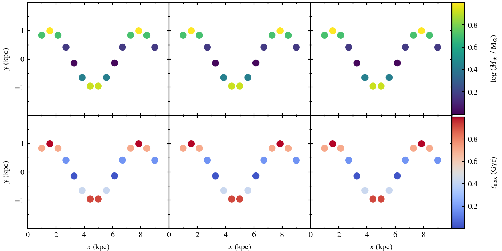

# templots
python templates for MNRAS plots

# About

Some python templates for plotting figures. Examples include several subplots layouts that are commonly needed.

The sizes and fonts are suitable for producing pdf figures which are precisely fitted for the MNRAS format: i.e. the width of the figure corresponds to the actual column width (or text width), such the the font size matches the text, with no need for resizing. Furthermore, the font family is essentially identical to the font of the text. (inpired by https://www.youtube.com/watch?v=OjPHx2-Bo6k)

The resulting pdf file sizes are very small: typically 15 kB for a simple line graph, rather than the 150 kB if tex fonts were embedded.

# Examples

